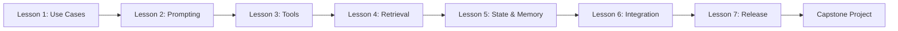
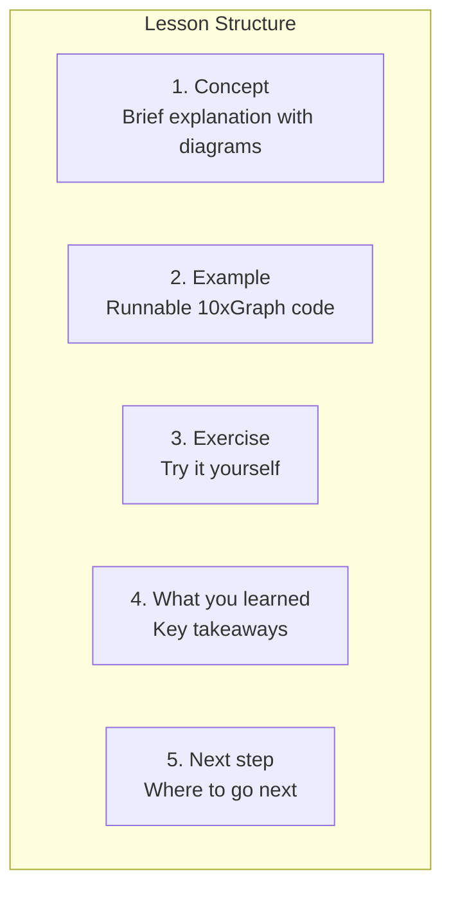

Build your first production-ready GenAI application with 10xGraph. This course takes you from "I know what an LLM is" to "I can ship a GenAI app with tools, memory, and evaluation."

## What You'll Build

A small engineer-facing assistant that:
- Answers questions using a curated knowledge source
- Uses tools safely (calculator, search, file operations)
- Accepts file or multimodal input
- Returns structured output (JSON)
- Supports thread continuity and memory
- Streams responses to a client
- Includes evaluation and a release checklist

## What You'll Learn

| Lesson | Topic | Key Concept |
|--------|-------|-------------|
| 1 | [Use cases, models, and the LLM app lifecycle](/docs/courses/genai-beginner/lesson-1-use-cases-models-and-app-lifecycle) | Pick the right use case before building |
| 2 | [Prompting, context engineering, and structured outputs](/docs/courses/genai-beginner/lesson-2-prompting-context-and-structured-outputs) | Build reliable outputs with schemas |
| 3 | [Tools, files, and MCP basics](/docs/courses/genai-beginner/lesson-3-tools-files-and-mcp-basics) | Extend the agent with safe tool use |
| 4 | [Retrieval, grounding, and citations](/docs/courses/genai-beginner/lesson-4-retrieval-grounding-and-citations) | Ground answers in real knowledge |
| 5 | [State, memory, threads, and streaming](/docs/courses/genai-beginner/lesson-5-state-memory-threads-and-streaming) | Build conversation-aware applications |
| 6 | [Multimodal and client/server integration](/docs/courses/genai-beginner/lesson-6-multimodal-and-client-server-integration) | Connect to frontends and handle files |
| 7 | [Evals, safety, cost, and release](/docs/courses/genai-beginner/lesson-7-evals-safety-cost-and-release) | Ship with confidence |

## Course Structure

## Prerequisites

- Python basics (functions, classes, async/await)
- Comfortable with API request/response formats
- No prior LLM or agent experience needed

## Time Commitment

| Component | Time |
|-----------|------|
| 7 lessons | 30-45 min each |
| Capstone exercise | 1-2 hours |
| **Total** | ~5-6 hours |

## How Each Lesson Is Structured

Every lesson includes:

1. **Concept** — Brief explanation with diagrams
2. **Example** — Complete, runnable 10xGraph code
3. **Exercise** — Try it yourself with guidance
4. **What you learned** — Key takeaways
5. **Next step** — Where to go next

## 10xGraph Concepts You'll Master

| Concept | Where It's Used |
|---------|----------------|
| [StateGraph](/docs/concepts/state-graph) | Lesson 1+ |
| [Tools and validation](/docs/concepts/agents-and-tools) | Lesson 3 |
| [Structured outputs](/docs/reference/python/agent) | Lesson 2, 7 |
| [Memory and stores](/docs/concepts/memory-and-store) | Lesson 4, 5 |
| [Checkpointing](/docs/concepts/checkpointing-and-threads) | Lesson 5 |
| [Streaming](/docs/concepts/streaming) | Lesson 5, 6 |
| [Client integration](/docs/get-started/connect-client) | Lesson 6 |

## Your Learning Path

### Start Here

If you're new to 10xGraph, start with these shared foundations:

1. [LLM basics for engineers](/docs/courses/shared/llm-basics-for-engineers) — What LLMs are
2. [Tokenization and context windows](/docs/courses/shared/tokenization-and-context-windows) — Why tokens matter
3. [Prompt patterns cheatsheet](/docs/courses/shared/prompt-and-output-patterns-cheatsheet) — Reliable prompting

### Then Continue With Lessons

Start with [Lesson 1: Use cases, models, and the LLM app lifecycle](/docs/courses/genai-beginner/lesson-1-use-cases-models-and-app-lifecycle)

## After This Course

After completing this course, you'll be ready for:

- **Advanced Course**: [Agentic product fit and system boundaries](/docs/courses/genai-advanced/lesson-1-agentic-product-fit-and-system-bounded-autonomy)
- **Production deployment**: [How-to guides](/docs/how-to/api-cli/initialize-project)
- **Real projects**: Build your own GenAI applications

<aside class="callout callout-note" role="note">
Coming from the Beginner Path?

If you've already completed the [Beginner Path](/docs/beginner), this course goes deeper into the "why" and "when" of GenAI system design. The lessons will feel familiar but with more context.

</aside>

---

**Ready to start?** Begin with [Lesson 1: Use cases, models, and the LLM app lifecycle](/docs/courses/genai-beginner/lesson-1-use-cases-models-and-app-lifecycle).
